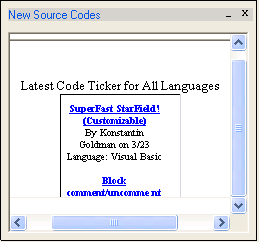



## New Source Codes v1\.0

### Description

I have made a code ticker so you can just check it for new codes put on PSC. Check out screenshot.
 
### More Info
 

             |
---                |---
**Submitted On**   |2002-03-23 12:56:18
**By**             |[Sehab](https://github.com/Planet-Source-Code/PSCIndex/blob/master/ByAuthor/sehab.md)
**Level**          |Beginner
**User Rating**    |4.2 (21 globes from 5 users)
**Compatibility**  |VB 6\.0
**Category**       |[Miscellaneous](https://github.com/Planet-Source-Code/PSCIndex/blob/master/ByCategory/miscellaneous__1-1.md)
**World**          |[Visual Basic](https://github.com/Planet-Source-Code/PSCIndex/blob/master/ByWorld/visual-basic.md)
**Archive File**   |[New\_Source648143232002\.zip](https://github.com/Planet-Source-Code/sehab-new-source-codes-v1-0__1-32994/archive/master.zip)

